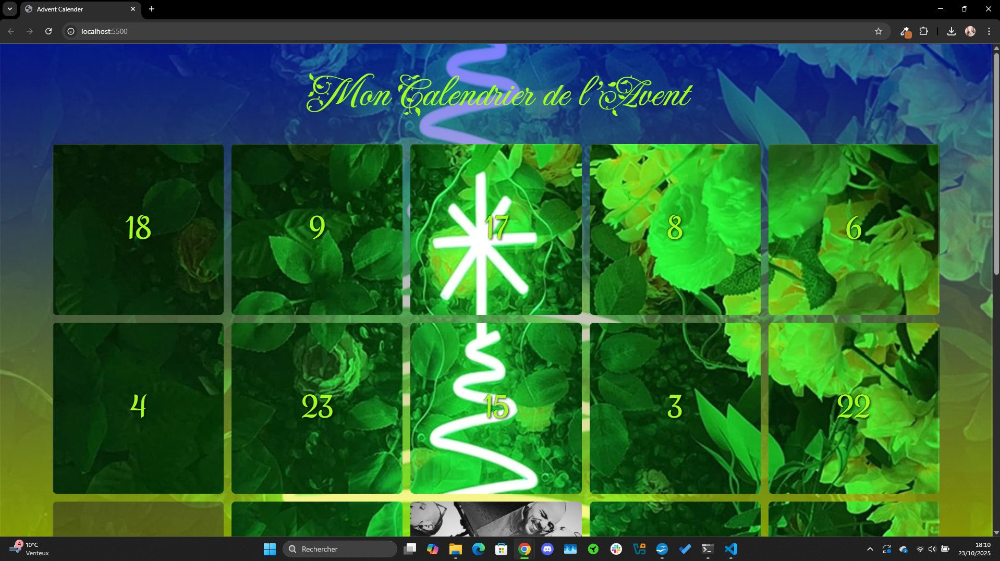
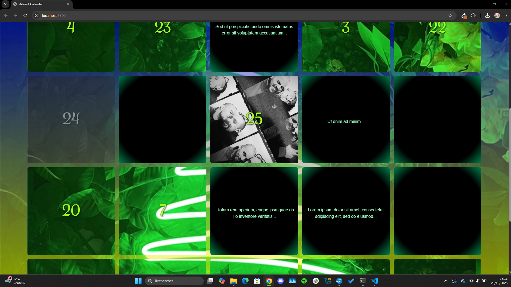
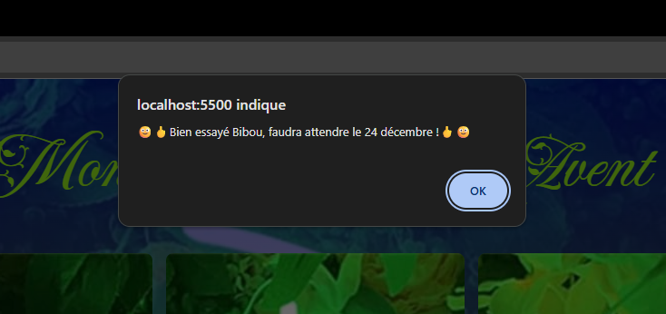

# forPavlos

# 🎄 Calendrier de l'Avent Interactif

Note : En production, vérifier month === 11 pour limiter à décembre  
Version démo : fonctionne toute l'année pour permettre aux recruteurs de tester

Un calendrier de l'Avent personnalisé avec déverrouillage progressif par date.






## ✨ Fonctionnalités

- 🗓️ **Déverrouillage par date** : Les cases se débloquent automatiquement  
  le jour correspondant
- 🎲 **Disposition aléatoire** : Algorithme Fisher-Yates pour mélanger les cases
- 🎴 **Animation 3D** : Effet flip sur les cartes au clic
- 🔒 **Système de verrouillage** : Empêche l'ouverture prématurée des cases

## 🛠️ Technologies utilisées

- **HTML5** : Structure sémantique
- **CSS3** : Animations 3D, Grid Layout, Custom Properties
- **JavaScript ES6+** : 
  - Manipulation DOM
  - Date API
  - Algorithmes de tri
  - Event listeners

## 🚀 Installation

```bash
git clone git@github.com:ValentinDuteil/forPavlos.git
cd forPavlos

# Ouvrir avec Live Server ou :
python -m http.server 8000

📂 Structure du projet
forPavlos/
├── index.html
├── stylesheet.css
├── reset.css
├── main.js
└── images/
    ├── split/          # 24 morceaux d'image
    └── us.jpg          # Image case 25


🎓 Apprentissages
Ce projet m'a permis de pratiquer :
✅ Algorithmes de tri (Fisher-Yates)
✅ Manipulation avancée du DOM
✅ CSS 3D (transform-style, perspective)
✅ Gestion d'état avec classes CSS
✅ Date API JavaScript

🐛 Bugs connus & améliorations prévues

 Ajouter localStorage pour sauvegarder les cases ouvertes
 Remplacer alert() par une modale custom
 Améliorer le responsive mobile
 Ajouter tests unitaires (Jest)

📝 Licence
Projet personnel - © Valentin Duteil 2024
🙏 Crédits
Développé avec ❤️ pour Pavlos
Algorithme Fisher-Yates : adapté depuis [https://github.com/echenim/FisherYatesShuffle]